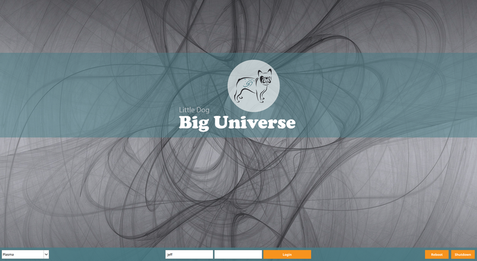

# ldbu-sddm-theme

This is a hack of plasma-theme-archpaint2 by Guidobelix.

Image from https://www.setaswall.com/grey-abstract-wallpapers/grey-abstract-wallpaper-09-2560x1600/
 
Thanks to all above.

## Todo

* Add hover color for buttons
* Inputs too small on hidpi

## Screenshot

